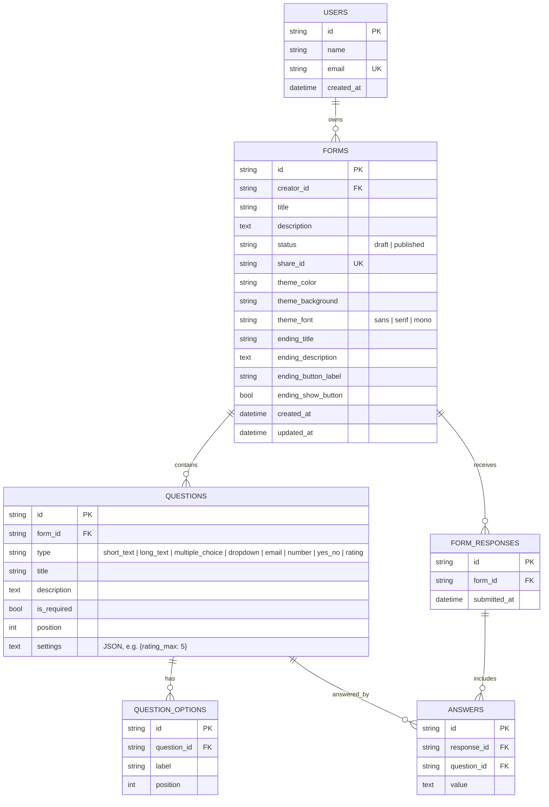

# FormFlow — Typeform Clone

A functional clone of Typeform: a drag-and-drop form builder,publishable shareable links, the
signature one-question-at-a-time respondent flow, and a results view with per-question stats.
Includes two of the brief's bonus items — [CSV export](#csv-export) and [dark mode](#dark-mode).

**Stack:** Next.js 15 (TypeScript) · FastAPI (Python) · SQLite

---

## Contents

- [Quick start](#quick-start)
- [Architecture](#architecture)
- [Database schema](#database-schema)
- [API overview](#api-overview)
- [Validation](#validation)
- [Features](#features)
- [Bonus features](#bonus-features) — CSV export, dark mode
- [Assumptions & scope](#assumptions--scope)
- [Deployment](#deployment)

---

## Quick start

Two processes: FastAPI on `:8000`, Next.js on `:3000`.

### Backend

```bash
cd backend
python -m venv .venv
# Windows:  .venv\Scripts\activate
# macOS/Linux:  source .venv/bin/activate
pip install -r requirements.txt
uvicorn main:app --reload --port 8000
```

The database file is created and seeded on first boot — no migration step. Interactive API docs
are at <http://localhost:8000/docs>.

### Frontend

```bash
cd frontend
npm install --legacy-peer-deps
cp .env.example .env.local   # defaults to http://localhost:8000/api
npm run dev
```

Open <http://localhost:3000>.

### Seeded data

`backend/seed.py` inserts one creator and three forms:

| Form | Status | Public link | Responses |
| --- | --- | --- | --- |
| Customer Product Feedback | published | `/f/demo-feedback` | 5 |
| Tech Summit 2026 Registration | published | `/f/demo-event` | 3 |
| Employee Onboarding Checklist | draft | *(none — unpublished)* | 0 |

Between them the questions cover all eight supported types. Deleting `backend/typeform.db`
re-seeds from scratch on the next boot.

---

## Architecture

```
backend/
  main.py         HTTP layer — routing, status codes, dependency wiring only
  crud.py         persistence + aggregation; every DB read/write lives here
  validation.py   answer rules; the authoritative validator
  schemas.py      Pydantic request/response contracts
  models.py       SQLAlchemy tables
  database.py     engine, session factory, SQLite FK pragma
  seed.py         sample data

frontend/src/
  app/                       routes (dashboard, builder, public form, results)
  components/Questions/      one input component per question type + registry
  components/Respondent/     welcome / question card / footer / ending screens
  components/Builder/        sidebar, canvas, inspector, share tab, settings tab
  components/Results/        summary cards, responses table, detail panel
  hooks/useFormFlow.ts       respondent state machine
  lib/api.ts                 typed fetch client
  lib/validation.ts          mirror of backend/validation.py
  lib/questionTypes.ts       type labels + icons, shared by every surface
  lib/theme.ts               theme presets and inline-style helpers
```

Three decisions worth calling out:

**1. One question-input registry, two consumers.** `components/Questions/QuestionInput.tsx` maps a
question type to a component. The respondent flow renders it interactively; the builder canvas
renders the same component with `disabled`. The live preview is therefore the real input, not a
lookalike — a new question type is one registry entry, not two parallel switch statements.

**2. Validation lives on the server; the client mirrors it.** `backend/validation.py` is the only
thing that decides whether a response is storable. `frontend/src/lib/validation.ts` repeats the
same rules purely so the respondent gets an instant inline message. To stop the two drifting,
the rule table is served at `GET /api/meta/validation-rules` and can be diffed against the mirror.

**3. Public and creator lookups are separate functions.** `crud.get_form()` (creator-side) resolves
a form by id *or* share id. `crud.get_published_form_by_share_id()` resolves by share id *and*
requires `status == "published"`. Only the second backs the public routes, so an unpublished form
is not reachable — not even by guessing its internal id.

---

## Database schema

Five tables. Every child relationship is `ON DELETE CASCADE`, and SQLite is opened with
`PRAGMA foreign_keys=ON` (see `database.py`) so those declarations are actually enforced.



Notes on the design:

- **Options are rows, not a JSON array.** Choice answers store the option label, so aggregating
  counts per option is a plain `GROUP BY`-shaped loop rather than JSON parsing.
- **`position` integers, not linked lists.** Reorder writes a contiguous `0..n-1` sequence in one
  pass; delete and duplicate close and open the gap so ordering never degrades.
- **`answers.value` is TEXT for every type.** One answers table beats eight typed columns or a
  polymorphic join, and `validation.py` normalizes on write (`"yes"` → `"Yes"`, `"7.0"` → `"7"`,
  emails lowercased) so aggregation can trust the stored strings.
- **`settings` is a JSON string in one column.** Per-type extras vary by type and would otherwise be
  a wide sparse table. It is parsed at the schema boundary, so the API exposes a typed object.
- **`users` exists even though auth does not.** Every form points at one seeded creator. Adding real
  sign-in later means inserting rows, not reshaping `forms`.

---

## API overview

Base path `/api`. Interactive docs at `/docs`.

### Meta

| Method | Path | Purpose |
| --- | --- | --- |
| `GET` | `/meta/validation-rules` | Rule table the client mirror is checked against |

### Forms (creator)

| Method | Path | Purpose |
| --- | --- | --- |
| `GET` | `/forms` | List forms with `status` and `response_count` |
| `POST` | `/forms` | Create a form (seeded with one starter question) |
| `GET` | `/forms/{form_id}` | Form with ordered questions and options |
| `PUT` | `/forms/{form_id}` | Update title, description, status, `theme`, `ending` |
| `POST` | `/forms/{form_id}/duplicate` | Deep copy; the copy is always a draft with a new share id |
| `DELETE` | `/forms/{form_id}` | Delete form and everything under it |
| `POST` | `/forms/{form_id}/publish` | Toggle draft ⇄ published; 400 if the form has no questions |

### Public respondent flow (no auth)

| Method | Path | Purpose |
| --- | --- | --- |
| `GET` | `/forms/share/{share_id}` | Fetch a **published** form; 404 otherwise |
| `POST` | `/forms/share/{share_id}/responses` | Submit; 422 with per-question errors, 404 if unpublished |

### Questions

| Method | Path | Purpose |
| --- | --- | --- |
| `POST` | `/questions/form/{form_id}` | Add a question (choice types get three default options) |
| `PUT` | `/questions/{question_id}` | Partial update; sending `options` replaces the whole set |
| `POST` | `/questions/{question_id}/duplicate` | Copy in place, shifting later questions down |
| `DELETE` | `/questions/{question_id}` | Delete and close the position gap |
| `PUT` | `/questions/form/{form_id}/reorder` | Body is an ordered array of question ids |

### Results

| Method | Path | Purpose |
| --- | --- | --- |
| `GET` | `/forms/{form_id}/responses` | Submissions, newest first, answers denormalized |
| `GET` | `/forms/{form_id}/responses.csv` | CSV download — one row per submission, one column per question |
| `GET` | `/forms/{form_id}/summary` | Per-question stats + answer-coverage rate |
| `POST` | `/forms/{form_id}/responses/delete` | Bulk delete, scoped to this form |
| `POST` | `/forms/{form_id}/responses` | Creator-side submit (backs "generate test response") |

Summary stats by type: choice/dropdown → count and percentage per option · yes_no → yes/no counts ·
rating → average, scale max, distribution · number → average, min, max · text/email → all answers.

---

## Validation

Both layers run the same rules; the server always runs them.

| Rule | Applies to | Message |
| --- | --- | --- |
| `required` | any required question | Please answer this required question before continuing. |
| `email` | `email` | Please enter a valid email address (e.g. name@example.com). |
| `number` | `number` | Please enter a valid numeric value. |
| `choice` | `multiple_choice`, `dropdown` | Please pick one of the available options. |
| `yes_no` | `yes_no` | Please answer "Yes" or "No". |
| `rating` | `rating` | Please pick a rating between 1 and N. |
| `too_long` | text types | Answer is too long (maximum N characters). |
| `unknown_question` | server only | This answer does not belong to the form being submitted. |
| `duplicate` | server only | This question was answered more than once. |

A rejected submission returns `422` with `{ detail, errors: [{ question_id, code, message }] }`.
The respondent flow reads that array, jumps back to the first offending question, and shows the
message inline.

Two things only the server can guarantee, and does:

- Answers whose `question_id` does not belong to the submitted form are rejected, not stored.
- Choice answers must match a real option label, so a crafted request cannot invent an option.

---

## Features

**Builder** — ordered question list with drag-and-drop reorder (`@dnd-kit`), add/duplicate/delete,
eight question types, per-question required toggle, description text, option manager, rating scale
length, and a live preview that renders the real respondent input in desktop or mobile viewport.
Question edits are debounced so typing a title is one request rather than one per keystroke.

**Form management** — dashboard listing status and response count, create, rename, duplicate,
delete, publish/unpublish. Copying an unpublished form's link warns that it is still a draft.

**Respondent flow** — full-screen one question at a time with Framer Motion transitions, progress
bar, `Enter`/`↓` to advance and `↑` to go back, `Shift+Enter` for newlines in long text, choice
questions that auto-advance on select, inline validation, confetti thank-you screen, and a
"submit another response" path. No login required.

**Results** — Insights, Summary and Responses tabs; per-question stats including a rating
histogram; a submissions table with one column per question and a sliding row-detail panel;
searchable; multi-select bulk delete; and a test-response generator that produces answers valid
under the server's own rules.

**Welcome & thank-you screens** — both are editable **pages on the Content tab**, not buried in
settings. Selecting one swaps the canvas for a centre-aligned editor and the inspector for that
screen's options: "time to complete" and "number of submissions" toggles on the welcome screen,
social icons and a call-to-action button on the ending. Either can be switched off entirely, in
which case respondents land straight on question one.

**Theme settings** — a Settings tab with colour presets, accent and background colour pickers and a
font choice, persisted on the form and applied to the public respondent flow.

**Toasts** — one app-wide provider (`components/ToastProvider.tsx`); every mutation reports success
or failure through it.

**Empty by default** — new questions and screens store blank titles so the editor shows its
placeholder (`Your question here…`) rather than boilerplate the creator has to delete first.
Read-only surfaces fall back to a label via `lib/labels.ts`.

---

## Bonus features

Two of the brief's optional items are implemented.

### CSV export

`GET /api/forms/{form_id}/responses.csv` streams a download built in `crud.responses_to_csv`:

```
Response ID, Submitted At, <question 1 title>, <question 2 title>, …
```

One row per submission, one column per question **in question order**, with blanks for skipped
answers — so the file lines up even when respondents skip optional questions. Reachable from two
places in the UI: the **Export CSV** button on the Summary tab, and the download icon in the
Responses toolbar. The filename is derived from the form title
(`customer-product-feedback-responses.csv`).

Because answers are normalized on write (`"yes"` → `"Yes"`, `"7.0"` → `"7"`, emails lowercased), the
exported values are already consistent and need no post-processing in a spreadsheet.

### Dark mode

A light/dark toggle sits in the dashboard and builder headers. It persists to `localStorage`,
follows the OS `prefers-color-scheme` until the user makes an explicit choice, and an inline script
in `app/layout.tsx` applies the class **before first paint** so dark-mode users never see a white
flash.

The implementation is a token swap rather than hundreds of `dark:` utilities. `globals.css` declares
the palette in `@theme`, and `.dark` re-points the same CSS variables:

```css
.dark {
  --color-ink: #ededf0;
  --color-surface: #1e1e23;
  --color-panel: #26262d;
  /* … */
}
```

Tailwind v4 utilities compile to `var(--color-*)`, so every component already written against these
tokens flips with no markup change. Two token *pairs* exist for this reason — `chrome`/`on-chrome`
and `inverse`/`on-inverse` — because inverting a single "ink" token would have left white text on a
now-light button.

**The respondent flow deliberately does not follow dark mode.** Published forms render the theme the
*creator* chose, so `/f/[shareId]` and `/preview/[formId]` are wrapped in `.tf-light-scope`, which
resets the tokens to light. A visitor's OS preference must not override a creator's branding, and
flipping the text token there would put near-white text on a light form background.

---

## Assumptions & scope

**Assumptions**

1. **Single creator, no auth.** All forms belong to a seeded `users` row (`creator-default`),
   matching the assignment's "assume a default logged-in creator". No login screen, no sessions.
2. **Share ids are 8-char slugs** and are the only public handle for a form. Duplicating a form
   mints a new one, so a copy never inherits a link that is already circulating.
3. **A submission is all-or-nothing.** Partial progress is not persisted, so drop-off analytics
   cannot be computed; the Insights tab labels those metrics as unavailable rather than inventing
   them. The one rate it does show — answer coverage — is computed from stored data.
4. **Unanswered optional questions are stored as empty strings**, so a submission always has one
   answer row per question. This keeps "answered vs skipped" a data question, not an inference.
5. **Rating scales run 1..N**, N clamped to 3–10, default 5.

**Bonus items implemented:** CSV export and dark mode (both documented above), plus custom themes
(accent, background and font per form).

**Bonus items not attempted:** logic jumps / conditional branching, file-upload question type, and
partial-response tracking. The third is the reason the Insights tab shows an em dash for views,
starts and completion time instead of inventing numbers.

**Deliberately left as placeholders** (per the brief): logic jumps and branching (Workflow tab),
integrations and webhooks (Connect tab), team collaboration, file-upload and payment question
types, AI question generation beyond a local stub, and the QR/embed options in the Share tab.
Each is visible in the UI marked *Coming Soon* rather than hidden.

---

## Deployment

**See [DEPLOYMENT.md](DEPLOYMENT.md)** for a step-by-step walkthrough — backend on Render,
frontend on Vercel, and the one decision to make about the database.

Short version:

| Part | Host | Root directory | Key setting |
| --- | --- | --- | --- |
| Backend | Render | `backend` | `ALLOWED_ORIGINS=<vercel url>` |
| Frontend | Vercel | `frontend` | `NEXT_PUBLIC_API_URL=<render url>/api` |

The database needs no setup: SQLite is created and seeded on first boot. On Render's free tier the
filesystem is ephemeral, so data resets on redeploy but re-seeds automatically — fine for a demo.
For durable storage, attach a persistent disk or point `DATABASE_URL` at Postgres; both are covered
in the guide.

Schema changes are additive-safe: `backend/migrations.py` adds any missing columns at startup, so
deploying a new column over an existing database does not require wiping it.

Environment variables are documented in `backend/.env.example` and `frontend/.env.example`.
`render.yaml` and `backend/Dockerfile` cover blueprint and container deploys respectively.
