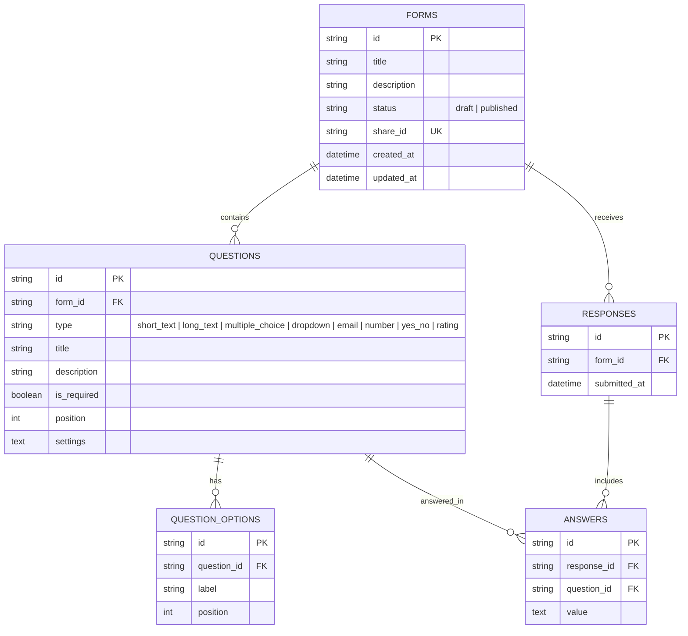

# FormFlow - Modern Typeform Clone

FormFlow is a full-stack, functional clone of the Typeform application built with **Next.js 15 (TypeScript)**, **FastAPI (Python)**, and **SQLite**. It replicates Typeform's signature design aesthetic, drag-and-drop form builder, public shareable respondent flow, and analytical results interface.

---

## 🌟 Key Features

### 1. Recreated Typeform Builder (`/builder/[formId]`)
- **Visual Design**: Recreates Typeform's clean builder interface with `Content`, `Workflow`, and `Connect` top navigation tabs.
- **Pages Sidebar**:
  - Live question list with numbers, type icons, and titles.
  - Drag-and-Drop question reordering via `@dnd-kit`.
  - **Dynamic Context Menu Rules**:
    - If **1 question** exists on the page list: context menu displays **Duplicate** only.
    - If **2 or more questions** exist: context menu displays **Duplicate** and **Delete**.
  - **"+ Add content" Modal**: Element catalog supporting Short Text, Long Text, Multiple Choice, Dropdown, Email, Number, Yes/No, and Rating scale questions, plus Bulk Question Import and AI Generation.
- **Live Preview Canvas**:
  - Real-time interactive preview of the form canvas.
  - Desktop / Mobile preview viewport toggle.
  - Inline title and description editing.
- **Question Settings Inspector (Right Panel)**:
  - Question type selector, required toggle, and interactive option manager for choice/dropdown fields.
- **Share & Publishing Overlay**:
  - Clicking **Share** displays a publishing animation.
  - Generates a unique shareable public link (`/f/[shareId]`).
  - One-click **Copy Link** button with instant feedback.
  - Publish / Unpublish toggle.

### 2. Full-Screen Public Respondent Flow (`/f/[shareId]`)
- **No Login Required**: Published forms are publicly accessible by anyone with the link.
- **Signature One-Question-at-a-Time Flow**: Full-screen view with Framer Motion slide-up and fade transitions.
- **Keyboard Navigation**: Advance with `Enter ↵` or `Arrow Down`, go back with `Arrow Up`.
- **Validation**: Client + server validation for required fields, email format, and numerical inputs.
- **Progress Indicator & Navigation**: Real-time progress bar, percentage counter, and bottom-right navigation buttons.
- **Branded Footer**: Clean "Powered by FormFlow" footer.
- **Celebratory Thank-You Screen**: Confetti celebration (`canvas-confetti`) upon submission with an option to submit another response.

### 3. Results & Analytics (`/forms/[formId]/results`)
- **Summary Tab**:
  - Per-question statistical breakdown.
  - Choice & Dropdown: Option counts & percentage progress bars.
  - Yes/No: Yes vs. No response breakdown.
  - Rating: Calculated average rating score + distribution.
  - Number: Average, Min, and Max metrics.
  - Text & Email: Scrollable feed of all submitted text responses.
- **Responses Tab**:
  - Data table listing every submission with timestamp and answer summary.
  - Clicking any submission row opens a side drawer showing all questions and exact answers submitted by that respondent.

---

## 🛠️ Tech Stack

- **Frontend**: Next.js 15 (TypeScript), Tailwind CSS, Framer Motion, `@dnd-kit/core`, `@dnd-kit/sortable`, `lucide-react`, `canvas-confetti`.
- **Backend**: Python 3.8+, FastAPI, SQLAlchemy, Pydantic, Uvicorn.
- **Database**: SQLite (`typeform.db`).

---

## 📁 Repository Structure

```
mts/
├── backend/
│   ├── main.py            # FastAPI main routes & CORS setup
│   ├── database.py        # SQLite engine & session configuration
│   ├── models.py          # SQLAlchemy database models
│   ├── schemas.py         # Pydantic schemas for API validation
│   ├── crud.py            # Database queries & analytics calculator
│   ├── seed.py            # Database seeding script
│   └── requirements.txt   # Python backend dependencies
├── frontend/
│   ├── src/
│   │   ├── app/
│   │   │   ├── page.tsx                  # Dashboard Workspace page
│   │   │   ├── builder/[formId]/page.tsx # Form Builder page
│   │   │   ├── f/[shareId]/page.tsx      # Public Respondent Flow
│   │   │   └── forms/[formId]/results/page.tsx # Results & Responses
│   │   ├── components/                   # Reusable UI components
│   │   ├── lib/api.ts                    # Backend API client
│   │   └── types/index.ts                # TypeScript interfaces
│   ├── package.json
│   └── tailwind.config.ts
└── README.md
```

---

## ⚙️ Setup & Running Locally

### 1. Backend Setup (FastAPI)
```bash
cd backend
python -m pip install -r requirements.txt
python seed.py # (Optional: pre-seeds DB with sample published & draft forms + responses)
python -m uvicorn main:app --reload --port 8000
```
*The FastAPI backend will start on `http://localhost:8000` and automatically create & seed `typeform.db` on launch.*

### 2. Frontend Setup (Next.js)
```bash
cd frontend
npm install --legacy-peer-deps
npm run dev
```
*Open `http://localhost:3000` in your browser to view the Typeform Clone dashboard.*

---

## 🗄️ Database Schema


